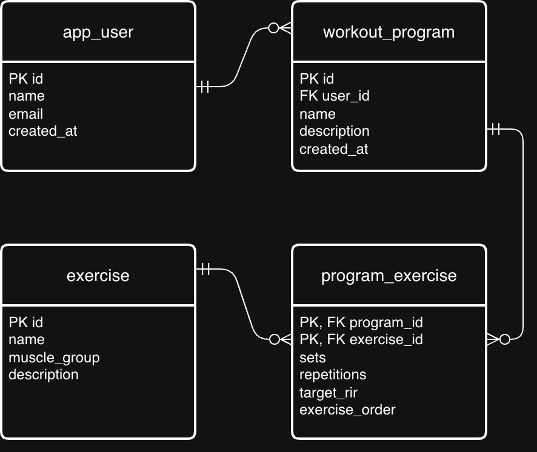

# Work Requirement 1 - PRO2003

## Project Description

This project contains a small PostgreSQL database for a strength training and progression platform.

The database stores users, workout programs, and exercises. Each exercise in a program can have planned sets, repetitions, target RIR (Reps in Reserve), and a position in the exercise order.

The database may later be expanded.

## ER Model

The ER model uses Crow's Foot notation to show the relationships between the tables.

The editable diagram is available in `docs/er-diagram.drawio`.

## Tables and Relationships

The database contains four tables:

- `app_user`: Stores users' names, email addresses, and creation times.
- `workout_program`: Stores programs and identifies the user each program belongs to.
- `exercise`: Stores exercise names, muscle groups, and optional descriptions.
- `program_exercise`: Connects programs and exercises and stores the planned training details.

There is a one-to-many relationship between `app_user` and `workout_program`. A user can have zero or more programs, while each program must belong to exactly one user.

There is a many-to-many relationship between programs and exercises. A program can contain several exercises, and an exercise can appear in several programs. The intermediate table `program_exercise` resolves this relationship through two one-to-many relationships.

A program can exist before exercises are added, and an exercise can exist without being used in a program.

## Design Decisions

The three main tables use automatically generated integer primary keys. These provide stable identifiers even if names or other information change.

The intermediate table uses a composite primary key consisting of `program_id` and `exercise_id`. This means an exercise can appear only once in each program in this version of the database.

Sets, repetitions, target RIR, and exercise order belong in the intermediate table because they can differ between programs using the same exercise.

`TEXT` is used for text values, `INTEGER` for whole numbers, and `TIMESTAMPTZ` for creation times. Creation times receive a default value using `CURRENT_TIMESTAMP`.

Table and column names use lowercase snake_case. The name `app_user` avoids using the SQL keyword `USER`.

## Constraints

- Primary keys uniquely identify each row.
- Foreign keys require referenced users, programs, and exercises to exist.
- `NOT NULL` makes required values mandatory.
- `UNIQUE` prevents duplicate email addresses and exercise names.
- `CHECK` requires sets, repetitions, and exercise order to be greater than zero.
- Target RIR is optional but cannot be negative.
- The combination of `program_id` and `exercise_order` is unique, preventing two exercises from occupying the same position in one program.

## How to Run

A running PostgreSQL server and a database client such as DBeaver are required.

1. Connect to PostgreSQL.
2. Create an empty database, for example `strength_training`.
3. Open an SQL editor connected to that database.
4. Open or copy the contents of `database/schema.sql` into the editor.
5. Execute the complete script in order.
6. Refresh the table list under `Schemas → public → Tables`.

## Verification

The SQL script was tested successfully in PostgreSQL using DBeaver.