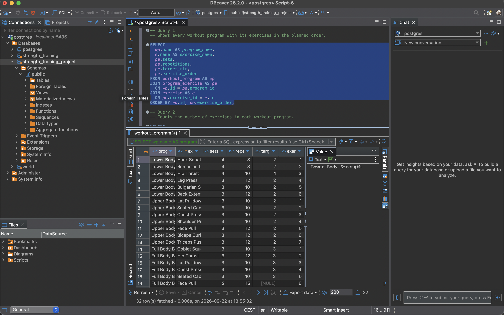
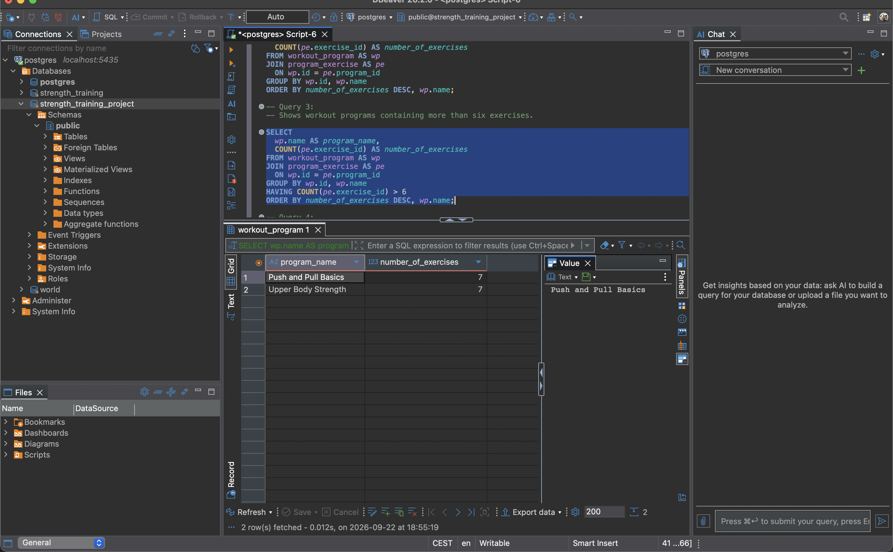
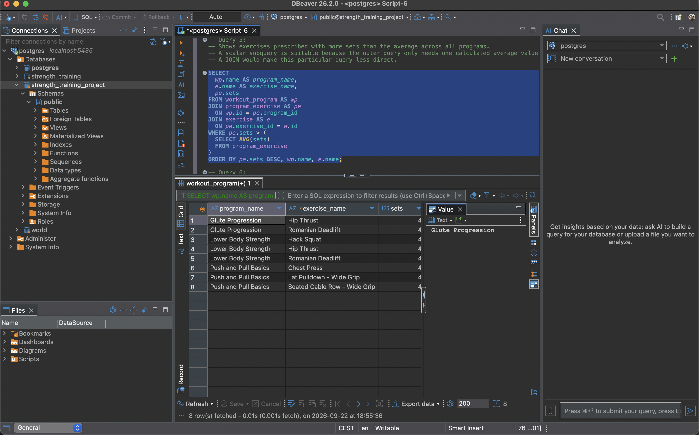
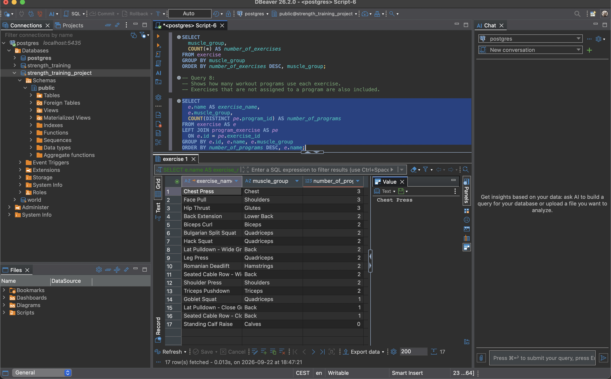

# Work Requirement 2 - PRO2003

## Project Description

This project contains a small PostgreSQL database for a strength training and progression platform.

The database stores users, workout programs, and exercises. Each exercise in a program can have planned sets, repetitions, target RIR (Reps in Reserve), and a position in the exercise order.

This work requirement builds on the database created for Work Requirement 1. The database has been populated with realistic test data and includes SQL statements for inserting, updating, deleting, retrieving, combining, and analyzing data.

The database may later be expanded.

## ER Model

The ER model uses Crow's Foot notation to show the relationships between the tables.

The editable diagram is available in `docs/er-diagram.drawio`.

## Tables and Relationships

The database contains four tables:

- `app_user`: Stores users' names, email addresses, and creation times.
- `workout_program`: Stores programs and identifies the user each program belongs to.
- `exercise`: Stores exercise names, muscle groups, and optional descriptions.
- `program_exercise`: Connects programs and exercises and stores the planned training details.

There is a one-to-many relationship between `app_user` and `workout_program`. A user can have zero or more programs, while each program must belong to exactly one user.

There is a many-to-many relationship between programs and exercises. A program can contain several exercises, and an exercise can appear in several programs. The intermediate table `program_exercise` resolves this relationship through two one-to-many relationships.

A program can exist before exercises are added, and an exercise can exist without being used in a program.

## Design Decisions

The three main tables use automatically generated integer primary keys. These provide stable identifiers even if names or other information change.

The intermediate table uses a composite primary key consisting of `program_id` and `exercise_id`. This means an exercise can appear only once in each program in this version of the database.

Sets, repetitions, target RIR, and exercise order belong in the intermediate table because they can differ between programs using the same exercise.

`TEXT` is used for text values, `INTEGER` for whole numbers, and `TIMESTAMPTZ` for creation times. Creation times receive a default value using `CURRENT_TIMESTAMP`.

Table and column names use lowercase snake_case. The name `app_user` avoids using the SQL keyword `USER`.

## Constraints

- Primary keys uniquely identify each row.
- Foreign keys require referenced users, programs, and exercises to exist.
- `NOT NULL` makes required values mandatory.
- `UNIQUE` prevents duplicate email addresses and exercise names.
- `CHECK` requires sets, repetitions, and exercise order to be greater than zero.
- Target RIR is optional but cannot be negative.
- The combination of `program_id` and `exercise_order` is unique, preventing two exercises from occupying the same position in one program.

## SQL Files

- `database/schema.sql`: Creates the database tables, relationships, and constraints.
- `database/seed.sql`: Populates the database with users, workout programs, exercises, and program details. 
- `database/data_operations.sql`: Demonstrates `INSERT`, `UPDATE`, and `DELETE` using a temporary user. 
- `database/queries.sql`: Contains eight documented queries for retrieving and analyzing the data. 

## Queries

The query file includes: 

1. Workout programs with their exercises in the planned order.
2. The number of exercises in each workout program. 
3. Programs containing more than six exercises. 
4. Total sets, average repetitions, and target RIR values for each program. 
5. Exercises prescribed with more sets than the overall average. 
6. Every user and the number of workout programs they own. 
7. The number of available exercises in each muscle group. 
8. The number of workout programs using each exercise. 

The queries demonstrates joins, aggregate functions, `GROUP BY`, `HAVING`, a scalar subquery, and a `LEFT JOIN`. 

## Query Results 

### Query 1 - programs and exercises

This query combines workout programs and exercises through the `program_exercise` table. 

### Query 3 - programs with more than six exercises

This query uses `GROUP BY` and `HAVING` to filter grouped results.

### Query 5 - exercises with above-average sets

This query uses a scalar subquery to calculate the average number of sets.

### Query 8 - exercise usage across programs

This query uses a `LEFT JOIN` so exercises without a workout program are also included.

## How to Run

A running PostgreSQL server and a database client such as DBeaver are required.

1. Connect to PostgreSQL.
2. Create an empty database, for example `strength_training`.
3. Open an SQL editor connected to the database.
4. Run `database/schema.sql` to create the tables.
5. Run `database/seed.sql` to populate the database.
6. Run `database/data_operations.sql` to test insert, update, and delete operations.
7. Run the statements in `database/queries.sql` to retrieve and analyze the data.

## Verification

All SQL scripts and queries were tested successfully in PostgreSQL using DBeaver. The screenshots above show selected query results. 